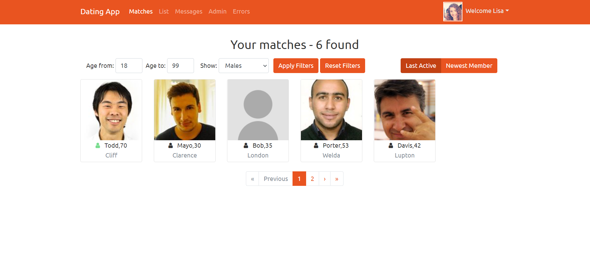

# ANGULAR_MVC
## 介紹
本作品參考自Udemy線上教學影片(詳見參考資料)，一起實作練習，前端框架為Angular，後端框架為 ASP NET MVC CORE，主題為交友軟體，練習主要包含：線上對話、自我介紹、加入好友、上限通知等等。

## 成果
1. 起始指令 (terminal)
前端
`kuei@MSI /angular_mvc (master)
$ cd client`
`kuei@MSI /angular_mvc/client (master)
$ ng serve`
後端
`kuei@MSI /angular_mvc (master)
$ cd api`
`kuei@MSI /angular_mvc/api (master)
$ dotnet watch run`
2. 打開網址：https://localhost:4200/
3. 展示
登入頁面

## 開發工具
1. Visual Studio Code
2. Postman

## 參考資料

Udemy線上課程：Build an app with ASPNET Core and Angular from scratch (by Neil Cummings)

